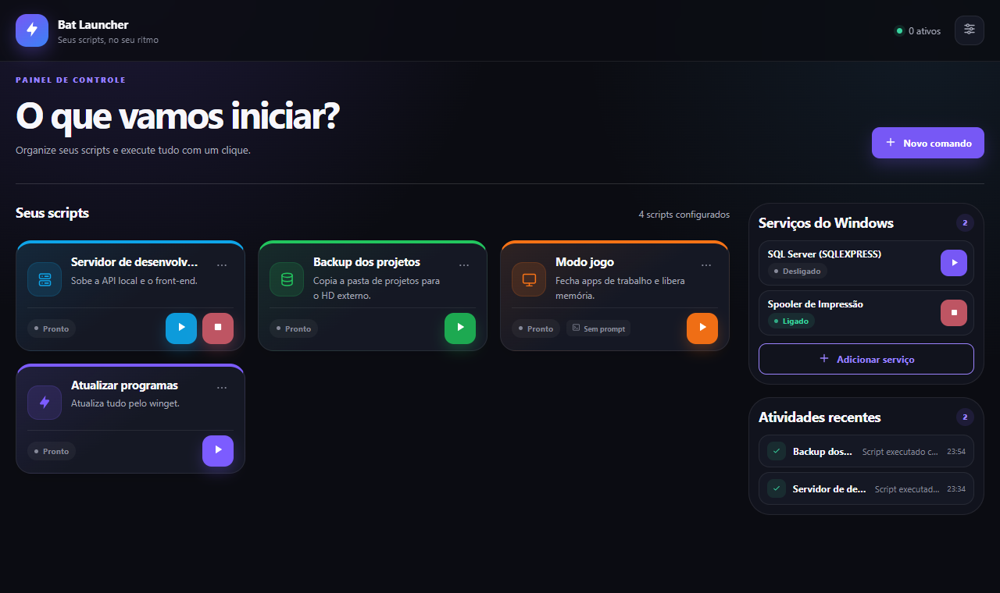
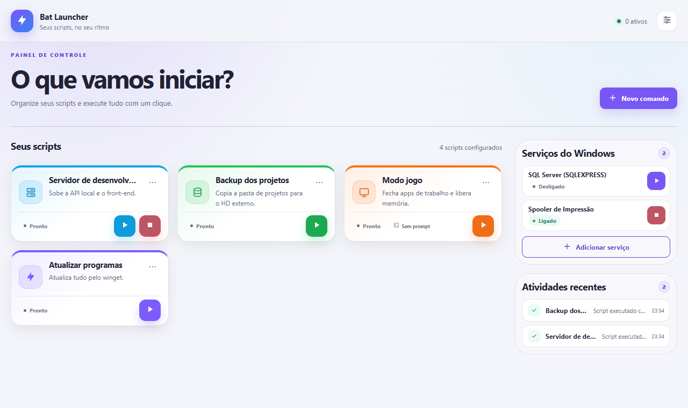
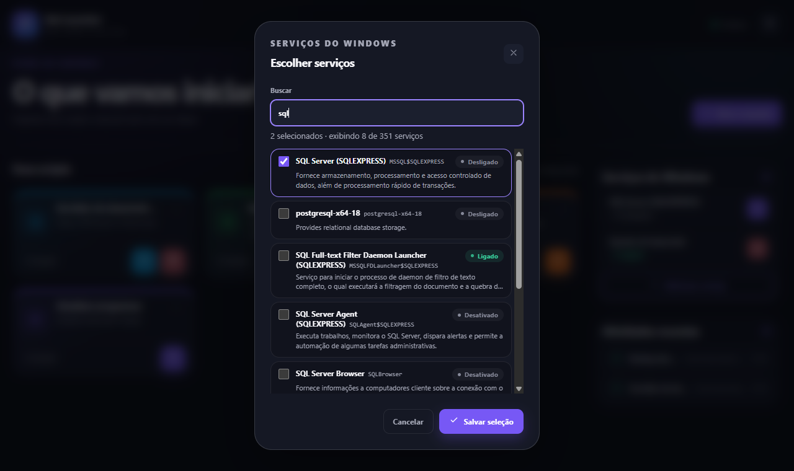
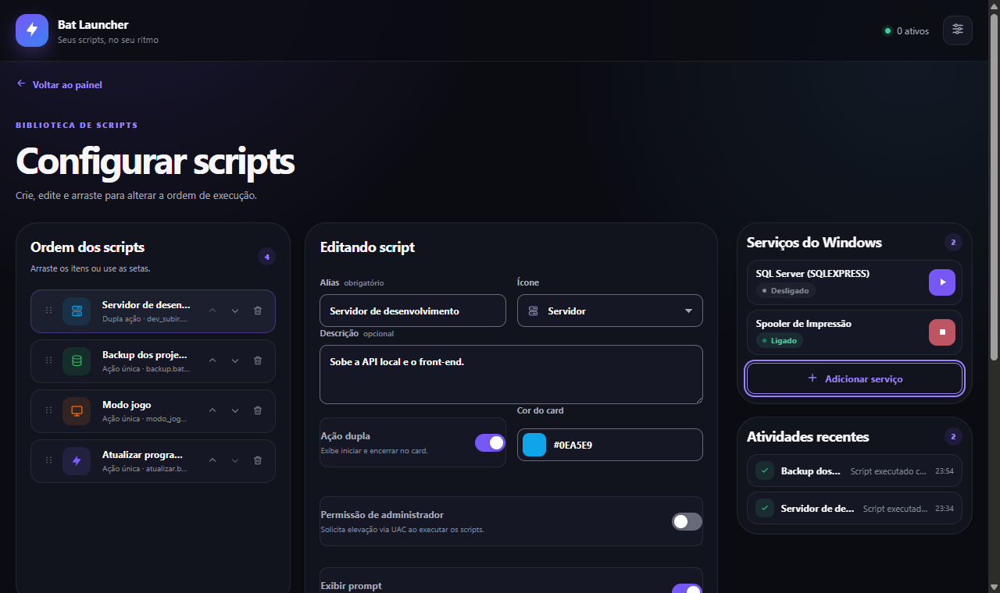
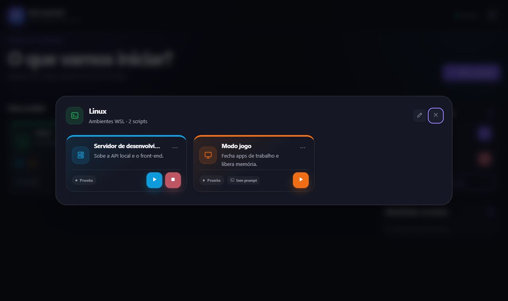

# Bat Launcher

Painel para Windows que transforma seus arquivos `.bat` em botões e liga ou desliga serviços do Windows com um clique.

Feito para quem usa o mesmo computador para coisas diferentes, como programar e jogar, e não quer deixar banco de dados, containers e outros serviços consumindo recursos o tempo todo.



## Recursos

- **Scripts como cards.** Cada `.bat` vira um card com nome, descrição, ícone e cor.
- **Ação dupla.** Um card pode ter um script para iniciar (▶) e outro para encerrar (■).
- **Grupos.** Junte scripts relacionados, como "Linux no terminal" e "Linux com interface gráfica", num único card. Ao clicar, ele abre os cards dos scripts do grupo.
- **Detecção automática de estado.** O app lê os seus `.bat` e reconhece o que eles controlam: distros do WSL, Docker Desktop, serviços do Windows e programas abertos com `start` ou fechados com `taskkill`. Quando reconhece, mostra se está ligado e exibe só o botão que faz sentido. Quando não reconhece, os dois botões ficam disponíveis.
- **Serviços do Windows.** Escolha numa lista, com busca, os serviços que você liga e desliga com frequência (PostgreSQL, SQL Server, etc.) e controle cada um direto pelo painel.
- **Terminal integrado.** Veja a saída do script em tempo real e envie entradas quando ele pedir.
- **Execução como administrador.** Scripts marcados como "admin" pedem elevação pelo UAC.
- **Atividades recentes.** As últimas execuções ficam salvas, inclusive o log dos erros.
- **Tema claro e escuro, cor de destaque personalizável.** O contraste segue o WCAG 2.2 nível AA, inclusive com as cores que você escolher.

<p>
  
  
</p>



## Instalação

Baixe a versão mais recente na página de [**Releases**](https://github.com/JonasSeneTorres/bat-launcher/releases/latest). Há duas opções:

| Arquivo | Descrição |
|---|---|
| `Bat-Launcher-Setup-x.y.z.exe` | Instalador. Permite escolher a pasta, cria atalhos no menu Iniciar e na área de trabalho e aparece em "Aplicativos instalados" para desinstalar. Não exige administrador. |
| `Bat-Launcher-x.y.z-portable.exe` | Versão portátil. Roda direto, sem instalar. |

Não é preciso ter Node.js nem npm instalados.

> **Aviso do Windows SmartScreen:** os executáveis não têm assinatura digital, então na primeira execução o Windows pode mostrar "O Windows protegeu o computador". Clique em **Mais informações** e depois em **Executar assim mesmo**.

## Como usar

### Cadastrar um script

1. Clique em **Novo comando**.
2. Dê um nome, escolha ícone e cor e selecione o arquivo `.bat`.
3. Se o script tiver um par de encerramento, ative **Ação dupla** e selecione o segundo `.bat`.
4. Opcional: ative **Permissão de administrador** para scripts que precisam de elevação, ou **Execução em segundo plano** para scripts que continuam rodando depois de fechar o terminal.

Para a detecção automática funcionar, basta o `.bat` usar comandos comuns, por exemplo:

```bat
wsl.exe -d Ubuntu
docker desktop start
net start postgresql-x64-16
start "" "C:\Program Files\MeuApp\app.exe"
taskkill /im app.exe /f
```

### Grupos

1. Em **Configurar scripts**, clique em **Novo grupo** e defina nome, ícone, cor e, se quiser, uma descrição.
2. No editor de cada script, escolha os grupos no campo **Grupos**. Um script pode estar em quantos grupos você quiser, inclusive em nenhum.
3. Na tela inicial, os scripts de um grupo deixam de aparecer sozinhos e o grupo vira um card com o ícone de cada script. Passe o mouse sobre um ícone para ver o nome do script; clique no card para abrir os scripts e usá-los normalmente.

Grupos sem scripts não aparecem no painel. Ao excluir um grupo, os scripts dele voltam a aparecer sozinhos.



### Serviços do Windows

1. No card **Serviços do Windows**, clique em **Adicionar serviço**.
2. Busque pelo nome ou pela descrição (por exemplo "postgres" ou "sql") e marque os serviços desejados.
3. Use ▶ e ■ no card para ligar e desligar.

Ligar e desligar serviços exige permissão de administrador, então o Windows pede confirmação pelo UAC a cada ação.

> **Dica:** se o serviço estiver com o tipo de inicialização **Automático**, ele volta a ligar sozinho a cada reinício. Para que ele só rode quando você quiser, mude para **Manual** em `services.msc`.

### Onde ficam os dados

A configuração (scripts, grupos, serviços e aparência) fica em:

```
%APPDATA%\Bat Launcher\buttons.json
```

Você também pode abrir essa pasta pelo app, em **Personalizar → Abrir pasta**. Desinstalar o app não apaga a configuração.

## Desenvolvimento

Requisitos: Windows 10 ou 11 e [Node.js](https://nodejs.org/) 22 ou mais recente (testado com o 24).

```bash
npm install
npm start
```

Em modo de desenvolvimento, a configuração fica em `data/buttons.json`, dentro do projeto. Essa pasta é ignorada pelo Git.

### Comandos

| Comando | O que faz |
|---|---|
| `npm start` | Abre o app em modo de desenvolvimento. |
| `npm run lint` | Verifica a sintaxe dos arquivos JavaScript. |
| `npm run icon` | Gera `build/icon.png` a partir de `build/icon.svg`. |
| `npm run pack` | Gera o app descompactado em `dist/win-unpacked`, para testes rápidos. |
| `npm run dist` | Gera o instalador e a versão portátil em `dist/`. |

### Estrutura

```
main.js              Processo principal: janela, execução dos scripts, serviços do Windows e configuração
preload.js           Ponte segura entre a interface e o processo principal
service-monitor.js   Detecção do que cada script controla e verificação de estado
script-runner.ps1    Executor usado pelos scripts que rodam como administrador
renderer/            Interface (HTML, CSS e JavaScript)
build/               Ícone do app
scripts/             Utilitários de build
docs/screenshots/    Imagens deste README
```

## Licença

Distribuído sob a licença MIT. Veja o arquivo [LICENSE](LICENSE).
